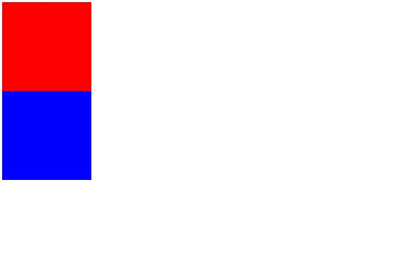
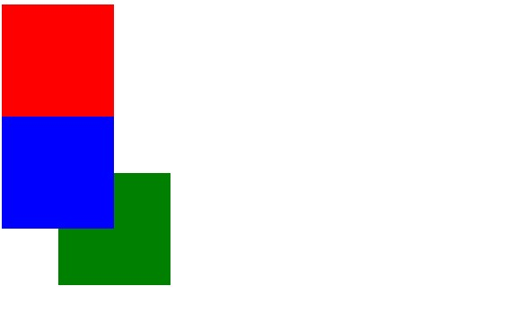
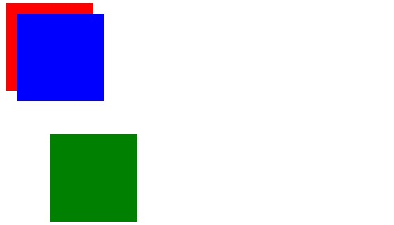
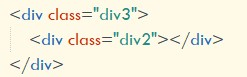
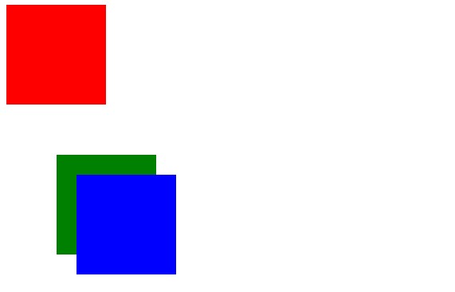
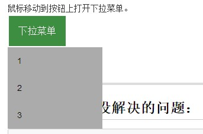

## 学习笔记第一周
-------------------------------------------------------
### 最近所学
> 重新去看了一下关于相对定位和绝对定位的一些区别知道了大概的一些区别：

 * 相对定位

		在HTML中设置三个不同颜色大小相同的盒子：

<html>
	<head>
		<meta charset="utf-8">
		<title></title>
		
	</head>
	<body>
		

		

		

	</body>
</html>

> 然后设置蓝色的盒子position属性为relative,left属性为100px，top属性为100px：

>
效果如下：

> 相当于蓝色的div相对于原来的位置先向右移动了100px，再向下移动了100px，并且没有与绿色div分为两行，但是实际上蓝色div的位置并没有发生改变，仍旧是在绿色div的上方，绿色div右边的蓝色区域实际上可以看做是蓝色div的影子。

------------------------------------------

+ 绝对定位
> 绝对定位脱离了文档流，并不会随着其他元素位置的改变而发生改变：如下：
> 
<html>
	<head>
		<meta charset="utf-8">
		<title></title>
		
	</head>
	<body>
		

		

		

	</body>
</html>

	设置蓝色div的position属性为absolute：
> 如图：
> 
	再将绿色div向右移动50px，向下移动50px：
> 

> 说明添加了绝对定位属性的蓝色div覆盖了绿色div。也说明了拥有position属性为absolute的蓝色div上升了一层层级。

> 绝对定位的元素的位置相对于最近的已定位祖先元素，如果元素没有已定位的祖先元素，那么它的位置相对于最初的包含块

先给蓝色div加上left，top各20px的位置，绿色div加上向右移动50px，向下移动50px的位置

----------------------------
然后将绿色div作为蓝色div的父级元素

---------------------------

	设置绿色div的position属性为relative（relative是absolute的父级元素）结果如图

---------------------------------------------

### 最近所学②

除了定位之外，也是去学习了有关导航栏和下拉菜单的相关知识

> 导航栏

<html>
<head>
<meta charset="utf-8">
<title></title>

</head>
<body>

<ul>
  <li><a class="active" href="#home">1</a></li>
  <li><a href="#news">2</a></li>
  <li><a href="#contact">3</a></li>
  <li><a href="#about">4</a></li>
</ul>

</body>
</html>

> 下拉菜单

<html>
<head>
<title></title>
<meta charset="utf-8">

</head>
<body>

<h2>下拉菜单</h2>

鼠标移动到按钮上打开下拉菜单。

  <button class="dropbtn">下拉菜单</button>
  

    <a href="#">1</a>
    <a href="#">2</a>
    <a href="#">3</a>
  

</body>
</html>

-------------------------------------------
##目前遇到的还没解决的问题：
	网页还无法实现自适应的情况，当窗口缩小时会出现以下的情况：
> 
 --------------------------------------------

	以及下拉菜单时还达不到一个渐变动画的效果：

--------------------------------------------------
> 近期仍旧是在对HTML和css的一些标签和属性做一些熟悉，所以JavaScript的进展目前来说较为缓慢，对于JavaScript的应用也还比较生疏，所以demo中还没有运用到相关JavaScript的知识。